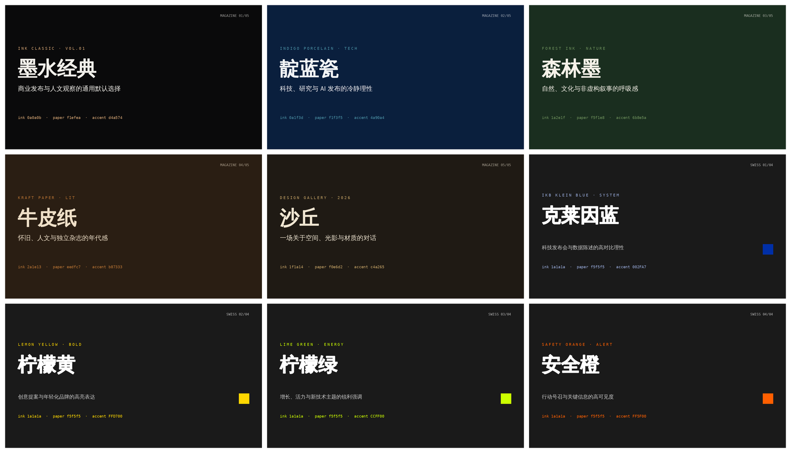

# PPT-Design-Skill

**An Agent Skill that generates real `.pptx` files — not HTML.** Built on PptxGenJS with 9 pre-built design themes (5 magazine + 4 Swiss) and 32 layout templates with production-ready coordinates.

[](#-theme-previews)

## ✨ Features

- 📦 **Real `.pptx` output** — editable in PowerPoint / WPS / Keynote, no HTML intermediate
- 🎨 **9 built-in themes** — 5 magazine (serif, editorial warmth) + 4 Swiss (sans-serif, grid-driven, high-contrast)
- 📐 **32 layout templates** — 10 magazine + 22 Swiss, each with ready-to-use `x/y/w/h` coordinates
- ✅ **Built-in QA workflow** — thumbnail generation, P0–P3 visual checklist, OOXML schema validation
- 🔧 **OOXML editing toolkit** — unpack / edit / pack existing decks, redlining support

## 📦 Install

```bash
npx skills add billLiao/PPT-Design-Skill --skill ppt-design-skill
```

## 🗣️ Trigger Phrases

- "帮我做一份 PPT / 幻灯片 / slide deck / pitch deck"
- "把这份大纲做成 .pptx"
- "用墨水经典 / 靛蓝瓷 / 森林墨 / 牛皮纸 / 沙丘 / 克莱因蓝 / 柠檬黄 / 柠檬绿 / 安全橙主题做演示稿"

## 🎨 Theme Previews

### Magazine Style (serif titles, warm tones, editorial feel)

| Theme | Ink | Paper | Accent | Best for | Preview |
|-------|-----|-------|--------|----------|---------|
| **Ink Classic** 墨水经典 | `0a0a0b` | `f1efea` | `d4a574` | General default, business, editorial | [PNG](docs/previews/theme-ink-classic.png) |
| **Indigo Porcelain** 靛蓝瓷 | `0a1f3d` | `f1f3f5` | `4a90a4` | Tech, research, data, AI launch | [PNG](docs/previews/theme-indigo-porcelain.png) |
| **Forest Ink** 森林墨 | `1a2e1f` | `f5f1e8` | `6b8e5a` | Nature, culture, non-fiction | [PNG](docs/previews/theme-forest-ink.png) |
| **Kraft Paper** 牛皮纸 | `2a1e13` | `eedfc7` | `b87333` | Humanities, nostalgia, literature | [PNG](docs/previews/theme-kraft-paper.png) |
| **Dune** 沙丘 | `1f1a14` | `f0e6d2` | `c4a265` | Art, design, creative, gallery | [PNG](docs/previews/theme-dune.png) |

### Swiss Style (sans-serif, grid-driven, high-contrast accent)

| Theme | Ink | Paper | Accent | Best for | Preview |
|-------|-----|-------|--------|----------|---------|
| **Klein Blue** 克莱因蓝 | `1a1a1a` | `f5f5f5` | `002FA7` | Tech launch, data-driven decks | [PNG](docs/previews/theme-klein-blue.png) |
| **Lemon Yellow** 柠檬黄 | `1a1a1a` | `f5f5f5` | `FFD700` | Creative pitches, youthful brands | [PNG](docs/previews/theme-lemon-yellow.png) |
| **Lime Green** 柠檬绿 | `1a1a1a` | `f5f5f5` | `CCFF00` | Growth, energy, new tech | [PNG](docs/previews/theme-lime-green.png) |
| **Safety Orange** 安全橙 | `1a1a1a` | `f5f5f5` | `FF5F00` | Calls to action, key alerts | [PNG](docs/previews/theme-safety-orange.png) |

> Rule of thumb: **one theme per deck** — never switch themes mid-deck. Colors are locked to the presets above; don't invent custom hex values.

## 🚀 Quick Examples

Runnable demo scripts for three representative themes:

```bash
cd skills/ppt-design-skill/examples
npm install
node demo-dune.mjs      # → demo-dune.pptx
node demo-magazine.mjs  # → demo-magazine.pptx
node demo-swiss.mjs     # → demo-swiss.pptx
```

## 📚 Documentation

| Document | Content |
|----------|---------|
| [SKILL.md](skills/ppt-design-skill/SKILL.md) | Skill entry point: 规划 → 生成 → QA workflow |
| [references/design-playbook.md](skills/ppt-design-skill/references/design-playbook.md) | **设计决策手册**: narrative arcs, page planning, theme rhythm, layout decision tree, adaptive rules, Chinese typography, density control |
| [design-system.md](skills/ppt-design-skill/design-system.md) | 9 themes + layout coordinate quick-reference + Office-safe font pairings |
| [pptxgenjs.md](skills/ppt-design-skill/pptxgenjs.md) | PptxGenJS API tutorial & corruption gotchas |
| [editing.md](skills/ppt-design-skill/editing.md) | Editing existing .pptx files (unpack → edit → pack) |
| [templates/layouts/](skills/ppt-design-skill/templates/layouts/) | Complete PptxGenJS layout code: 10 magazine + 22 Swiss (S01-S22) |
| [templates/components.md](skills/ppt-design-skill/templates/components.md) | Component cookbook (stat cards, callouts, icon rows, charts) |
| [references/checklist.md](skills/ppt-design-skill/references/checklist.md) | P0–P3 QA checklist (.pptx specific, with no-LibreOffice fallback) |

## 📄 License

This repository contains materials derived from [anthropics/skills](https://github.com/anthropics/skills) (PPTX skill) — those parts remain © Anthropic, PBC under the included [LICENSE.txt](skills/ppt-design-skill/LICENSE.txt). Original design-system content (themes, layouts, components) is provided under the same terms for consistency.

## 🙏 Acknowledgments

- [anthropics/skills](https://github.com/anthropics/skills/tree/main/skills/pptx) — OOXML toolkit & QA workflow
- [op7418/guizang-ppt-skill](https://github.com/op7418/guizang-ppt-skill) — design inspiration

---

## 中文说明

一个 Agent Skill：**直接生成可编辑的 `.pptx` 文件，而不是 HTML**。基于 PptxGenJS，内置 9 套预置主题（5 套电子杂志风 + 4 套瑞士国际主义风）与 32 种页面版式模板（全部提供完整可运行代码）。

### 生成流程（v2 重构核心）

```
规划（叙事弧 + 页面规划表 + 明暗节奏） → 生成（版式代码 + 自适应规则） → QA（P0-P3 检查清单）
```

- **版式是基线不是牢房**：每个版式标注内容形状（几项 × 几字），条目增减按自适应公式变形，不再硬塞固定坐标
- **只用 Office 安全字体**：中文 deck 用华文中宋 / 微软雅黑 / Consolas，英文 deck 用 Cambria / Calibri / Arial——网页字体在用户机器上会 fallback 宋体
- **中文排版分档**：字号分档、字重阶梯、每页 ≤ 90 字密度控制
- **原生图表优先**：排名/趋势/构成用 addChart，附防损坏 gotcha

详见 [设计决策手册](skills/ppt-design-skill/references/design-playbook.md)。

### 安装

```bash
npx skills add billLiao/PPT-Design-Skill --skill ppt-design-skill
```

### 触发方式

对 Agent 说：「帮我做一份 PPT」「把这份大纲做成 .pptx」「用沙丘主题做演示稿」等。

### 主题体系

- **杂志风（5 套）**：墨水经典（默认通用）、靛蓝瓷（科技/AI）、森林墨（自然/文化）、牛皮纸（人文/怀旧）、沙丘（艺术/设计）
- **瑞士风（4 套）**：克莱因蓝、柠檬黄、柠檬绿、安全橙——高对比强调色 + 网格驱动

使用原则：**一份 deck 只用一套主题**，色彩锁定预设值，不自定义 hex。

### 本地运行示例

```bash
cd skills/ppt-design-skill/examples
npm install
node demo-dune.mjs   # 生成 demo-dune.pptx
```

### 质量保障

内置 P0–P3 视觉检查清单（文字溢出、元素重叠、主题一致性、字号下限等）、缩略图生成脚本与 OOXML schema 校验，详见 [SKILL.md](skills/ppt-design-skill/SKILL.md)。

### 预览图再生成

```bash
python3 docs/generate_previews.py   # 需要 Pillow + 中文字体
```
